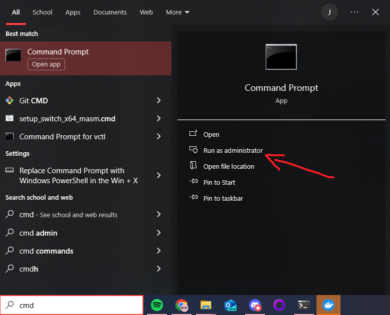
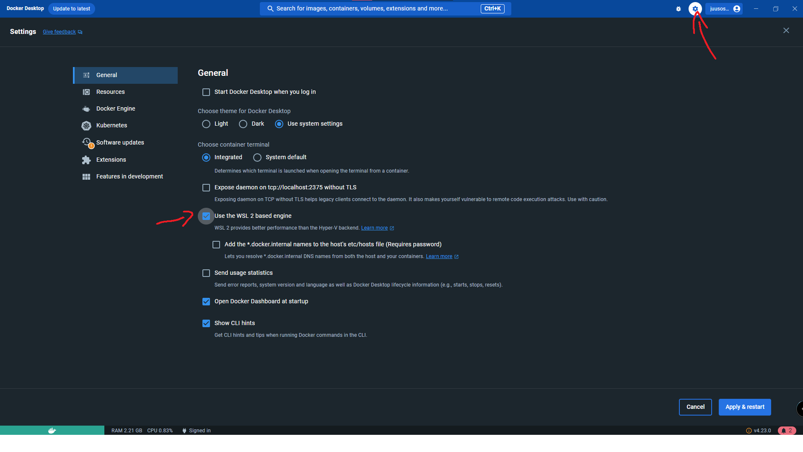

# Why Docker
Docker lets us define a runtime explicitly for the application, detaching the system of the user from the application itself.
To run our application in Docker, we need the Docker engine, which can be installed with guides from the [Docker installation page](https://docs.docker.com/engine/install/).
# Linux
First install Docker for your distribution, for example on Ubuntu
```console
snap install docker
```
# Mac
On Mac, we have to install [Docker desktop](https://docs.docker.com/desktop/install/mac-install/). After installation, Docker can be used from the terminal.
# Windows
Windows also requires us to install [Docker Desktop](https://docs.docker.com/desktop/install/windows-install/). After installation, Docker can be used from the command line.

If your system doesn't recognize Docker, you might need to:

- Download WSL (Windows Subsystem for Linux) by opening Windows terminal (Command Prompt) or PowerShell in administrator mode.

Then type
```console
wsl --install
```
This installs WSL to your machine, then we need to enable WSL support for Docker in the Docker desktop settings

# Docker compose
After installing Docker and making sure the engine is running, bring up the application by running the following command in the root folder of the application folder:
```console
docker compose up
```
which takes the arguments from compose.yml, which defines the ports and settings in a yml format. 
Consider adding a `--build` flag to force the building of the image if it for some reason fails the first time. Daemon problems tend to be caused by permission issues, or because docker service is not running.

# For development
## Docker image of the app
To first create a docker image, you have to run:
```console
docker buildx build . -t canvas
```
or

```console
docker build . -t canvas
```
depending on your system. 

## Running the docker image
To run the created image, use 
```console
docker run -d -p 5000:5000 canvas
```
To run SmartCanvas as (-d) detached from the terminal process and (-p) connecting port 5000 to 5000 

Now the application should be available at localhost:5000
